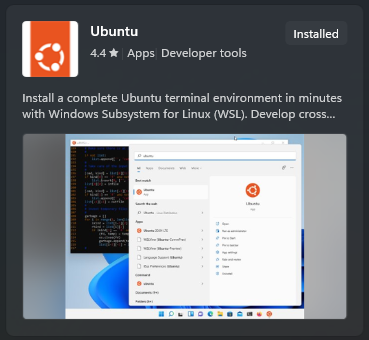

# Guitar-Learning-Assistant-RTEP5


This repository is for the development of a real-time learning assistant used to help beginner guitarists practice. 

The intention with this product is to enable users to effectively learn basic guitar skills with real-time feedback.

The product works by first prompting the user to play a random chord/note/scale etc... (screen)
If the user plays correctly, the screen will show correct (✓) and moves on to the next random shape
If the user plays incorrectly, the screen will show wrong (X) and briefly show the correct shape. Then it will prompt the same item again.

The device has to react to the signal received from the guitar, and determine if the sound is correct or not.

## Setup instructions
### 1. Install WSL (Windows only)
Go to the microsoft store and search for WSL or Ubuntu and install Ubuntu


An instance of WSL can be opened by searching and running Ubuntu from the windows search bar, or by typing wsl is cmd or powershell.

On opening for the first time there will be some setup - it asks you to setup an account and create a user password iirc but thats pretty much it.

This link provides more information on installing WSL https://learn.microsoft.com/en-us/windows/wsl/install
### 2. Install dependencies
Run the following commands in wsl to install the correct dependencies:
```
sudo apt update
sudo apt upgrade
sudo apt-get install clang
sudo apt-get install gcc
sudo apt-get install gdb
sudo apt-get install clang-tidy
```
### 3. Build the repository
After cloning the repo it can be built by running build.sh
```
./build.sh
```

## SSH
### Connect to Raspberry Pi via SSH on Windows
Open powershell, enter:
```
ssh team29@team29.local
```
Then, as prompted: enter the password

#### Autoconnect without needing passphrase via SSH passphrase
1. Create a keypair on your Windows machine with
   ```
   ssh-keygen -t rsa -b 4096
   ```
   When propmted where to save the key, press enter.
   When asked for passphrase, enter one if you want that.
2. Copy SSH key
   On windows powershell enter:
   ```
   Get-Content $env:USERPROFILE\.ssh\id_rsa.pub
   ```
   Copy entire reponse, including ssh-rsa
3. Connect to raspberry via ssh (ssh team29@team29.local) -> enter passphrase
4. Once logged in enter:
   ```
   mkdir -p ~/.ssh && nano ~/.ssh/authorized_keys
   ```
   Paste the copied key from your windows machine.
   Press Ctrl+X, then Y, then Enter to close & save the file
5. Ensure permissions are set correctly, run
   ```
   chmod 600 ~/.ssh/authorized_keys
   ```
   On raspberry pi
7. Logout from ssh connection with
   ```
   exit
   ```
8. Test connection without requirement of passphrase
   Connect with team29@team29.local
   This time it should not require a passphrase

### Connect via VS Code, without needing passphrase
1. Install SSH Remote connection extension
2. Open remote explorer


3. Add new remote


4. Enter ssh address


5. Select ssh file to update (typically the one of your desktop user, in my case Raphael Nekam)

6. Open SSH connection


7. Select OS (Linux)


### Get IP of Raspberry in network:
```
Resolve-DnsName team29.local

```


### Add new WiFi credentials to Raspberry
This could be convenient to access the raspberry from your home network, without needing to connect it to your router via LAN

1. Connect to raspberry via ssh (team29@team29.local)
2. Open network manager ui
   ```
   sudo nmtui
   ```
   This should open an interface:


3. Edit connection -> Add


4. Choose WiFi


5. Enter details
   Profile name -> e.g. your name (just a label for the connection)
   SSID -> Network name
   Security -> Most likely WPA & WPA2 Personal
   Password
   -> Keep the rest free
6. Press okay, then back, then ok
7. Reboot likely needed to confirm changes
   ```
   sudo reboot
   ```

